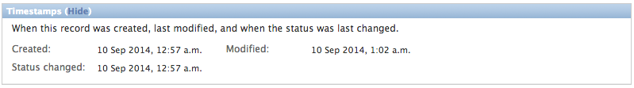

Django-mininews
===============

.. image:: https://pypip.in/v/django-mininews/badge.png
    :target: https://crate.io/packages/django-mininews/
    :alt: Latest PyPI version

.. image:: https://pypip.in/d/django-mininews/badge.png
    :target: https://crate.io/packages/django-mininews/
    :alt: Number of PyPI downloads

.. image:: https://travis-ci.org/richardbarran/django-mininews.svg?branch=master
    :target: https://travis-ci.org/richardbarran/django-mininews

Django-mininews is a basic tool for controlling the *publication* of objects.

Let's take an example: you have a 'news' application, that just consists of a 
Article model. In the admin interface, we have this:

.. image:: docs/img/mininews-fieldset.png

All articles have the following 3 fields:

- status: usually 'draft' or 'published'.
- start: start date, defaults to whenever the status is changed to ``published``.
- end: end date; optional.

Articles can only be viewed in the public website **if** they are ``published``
**and** between the start and end dates.

Oh, we also have a fieldset for showing various read-only status fields:

These can be of use for tracking changes to an Article.

And that's it... Mininews is just some boilerplate code, that you will 
reuse again and again throughout a project.

Installation and usage
----------------------
Please take a look at
`the documentation <http://django-mininews.readthedocs.org/en/latest/index.html>`_ on ReadTheDocs.
